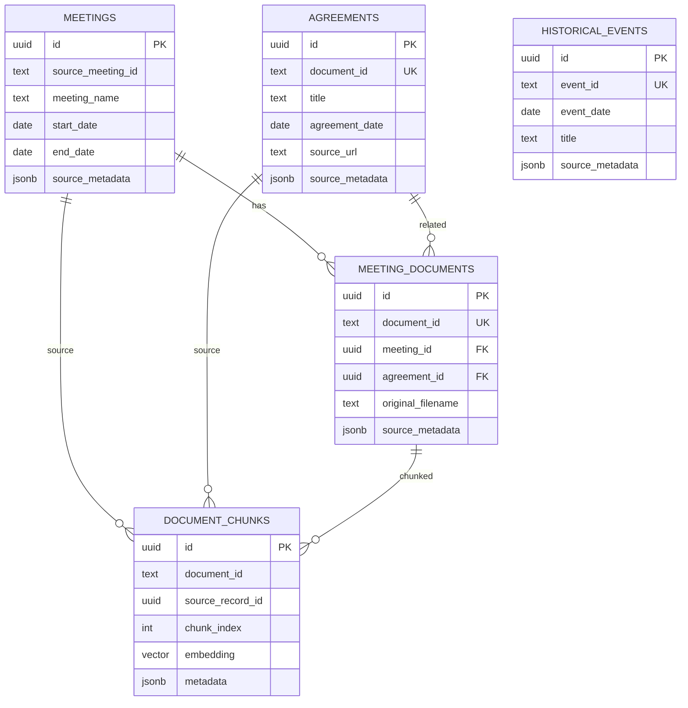

# Phase 3 데이터 모델

## Mermaid ERD

## 관계 원칙

- 해설자료와 회담·합의서 관계는 확정된 경우에만 nullable FK를 설정한다.
- 제목 유사도만으로 `meeting_id` 또는 `agreement_id`를 자동 확정하지 않는다.
- `document_chunks.source_record_id`는 원본 테이블의 UUID를 가리키며, `source_table`로 실제 출처 테이블을 함께 기록한다.
- 임베딩 인덱스는 실제 chunk 규모와 검색 패턴을 확인한 뒤 별도 단계에서 추가한다.
